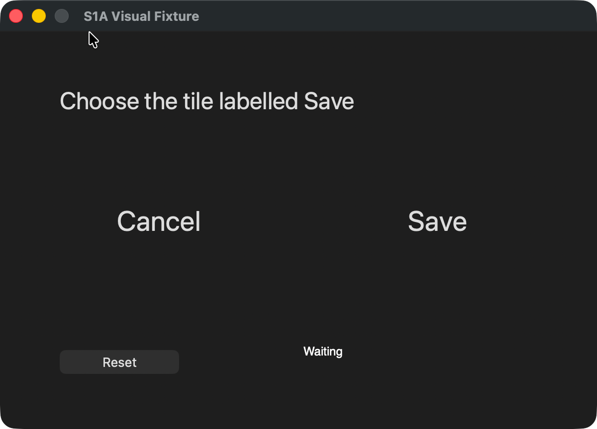
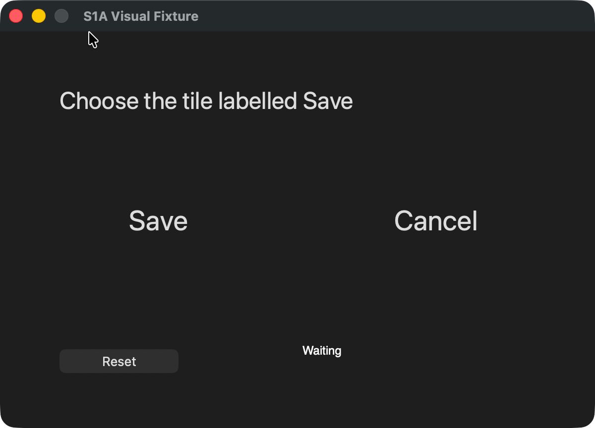

# Screenshot target-selection evidence

Source and test revision: [`cf49ee6635abc202a2beb5404ac02e54ebd0abbc`](https://github.com/ThinkFlowLab/system1-agents/commit/cf49ee6635abc202a2beb5404ac02e54ebd0abbc).
Fixture: [visual_fixture.swift](visual_fixture.swift). Save/Cancel are drawn pixels, absent from the
accessibility children. Reset swaps their positions. The fixture appends the actually selected tile to
`/tmp/s1a-visual-target.txt`; the recorder checks each new row and a fresh mtime independently.

The native runs below were made on 2026-10-05 from clean source checkouts. The follow-up adds
documentation only. PR merge base: `222e656a1a53d7d19c815d8ac66defaad557b1c5`; upstream `main`
was refreshed at `a2c46f4f40ce2c580f2bce14e6efb0b3315923e5` and was not merged into the PR.

These records replace the earlier author-reported native figures. The earlier raw artifacts and their
source bindings were unavailable, so their revision, retries and interventions could not be audited.
No historical timing is reused here. All native attempts made for this follow-up are listed.

Mac: macOS 26.2 (25C56), arm64; Python 3.13.5; Swift 6.3. Cua Driver 0.30.1, using the signed
`/Applications/CuaDriver.app/Contents/MacOS/cua-driver`, standard permission mode, Accessibility and
Screen Recording enabled. Input delivery was background, bound to the fixture's PID/window ID.
The driver offered an update; it was left at 0.30.1 throughout these runs.

Episode time starts **after reset** and includes per-episode agent cleanup. It excludes model
construction/loading, fixture launch/reset, imports and series/model teardown. Command wall time includes those costs. Model files were
downloaded before the timed commands. These are small fixture demonstrations, without a baseline/head
speed comparison or a general task-success-rate claim. Total cost was not measured.

## Native results

| Run | Task successes | Episode seconds | Model decisions / task clicks |
|---|---:|---|---|
| Real Cua-S1 4B, seeds 0–3 | 4/4 | 10.8, 8.0, 8.5, 8.2 (35.5 total) | 4 / 4 |
| Fixed correct point, seed 0 | 1/1 | 2.9 | 0 / 1 |
| Fixed wrong point, seed 0 | 0/1, as intended | 3.0 | 0 / 1 |

Real model: [`cua-ai/cua-s1-4b-0.2@16818868b0cc7813808aae4e87b417657046ab79`](https://huggingface.co/cua-ai/cua-s1-4b-0.2/tree/16818868b0cc7813808aae4e87b417657046ab79), `multimodal` adapter;
base [`Qwen/Qwen3.5-4B@851bf6e806efd8d0a36b00ddf55e13ccb7b8cd0a`](https://huggingface.co/Qwen/Qwen3.5-4B/tree/851bf6e806efd8d0a36b00ddf55e13ccb7b8cd0a).
Scorer source: [`trycua/cua@aea61b6eb97e2d8c0f6f71eb804e5769fe910af4`](https://github.com/trycua/cua/tree/aea61b6eb97e2d8c0f6f71eb804e5769fe910af4/libs/cua-s1/python).
PyTorch 2.14.0, torchvision 0.29.0, Transformers 5.17.0, PEFT 0.21.0; MPS/bfloat16.
`HF_DEACTIVATE_ASYNC_LOAD=1`, `PYTORCH_ENABLE_MPS_FALLBACK=1`; all packages came from the PR lock file.

Model construction: **11.188 s**; `warm()` loading: **4.246 s**; command wall: **79.074 s**;
episode mean: **8.9 s**; median decision: **5.424 s**. The model selected **right, left, right, left**.
There was one configured Reset setup click before each episode, outside the task-click counts/timers.
No fixed plan, hosted decision/chat calls or manual action was used in the Cua-S1 run.

Both controls used a newly launched fixture and an empty output file. The fixed wrong point clicked
Cancel: the file contained `Cancel selected`, status was `Wrong tile`, and score was 0. The click itself
was delivered; the **task verifier** rejected the result. The CLI exited 0 even for that unsuccessful task.
The wrong-point control is retained alongside the model successes, not counted as a model failure or success.

All pixel input replies reported `effect=unverifiable`, `route=synthetic_events`, background delivery.
The driver does not prove the click's effect; the changed fixture status and independently appended file row do.
Transformers logged its `torch_dtype` deprecation and reference-kernel fallbacks for `causal_conv1d` and
`chunk_gated_delta_rule`. Dependency syntax warnings and the driver update notice were also present.
No run failed to execute, no trial was discarded, and no mid-episode intervention/retry occurred.
The two controls ran first; the fixture was restarted and its output cleared once more before the model run.

## Captured frames and complete decision trace

These are unmodified, actual window captures from the source revision above. They show only the fixture.
The first two are the images supplied to Cua-S1 in seeds 0 and 1 (also repeated in seeds 2 and 3).
The third is the final wrong-point control. These are selected still frames, with no video speedup or stitching.
The trace retains all four model decisions, both controls and every independent file verdict.






Save/Cancel positions below were checked in those captures and follow the fixture's Reset toggle.
Capture IDs keep their original counter suffix; the process/session prefix and PID/window ID are normalized
to `fixture-window`. Every logged pixel click matched the current capture and the bound fixture target.

```text
Real Cua-S1
  seed=0 start=2026-10-05T06:11:27.261021+00:00 Save=right Cancel=left
    capture_suffix=0000000000000069 size=1200x864 image_sha256=920ae73883095286d3ca9bd34a879e2d9576ebc918f9e081a4048721a2c04dca
    choice=pixel:right decision_ms=7669 confidence=0.969
    real click: x=876.0 y=440.64 capture_suffix=0000000000000069 target=fixture-window
    driver effect=unverifiable route=synthetic_events delivery=background
    readback Status="Saved" presses=["pixel:right"] score=1.0
    episode_s=10.8 error=None chat_calls=0 invalid_keys=0
  independent file check: fresh=True matches=True content="Save selected\n"
    before_mtime_ns=1791180652314305935 check_started_ns=1791180684138334000 after_mtime_ns=1791180696551327880
  seed=1 start=2026-10-05T06:11:40.439777+00:00 Save=left Cancel=right
    capture_suffix=000000000000006c size=1200x864 image_sha256=b0cbf2a5676018b4f4ac79e7f28a98ef61bfed9a14521df4fa04413db9a815cc
    choice=pixel:left decision_ms=5076 confidence=0.784
    real click: x=324.0 y=440.64 capture_suffix=000000000000006c target=fixture-window
    driver effect=unverifiable route=synthetic_events delivery=background
    readback Status="Saved" presses=["pixel:left"] score=1.0
    episode_s=8.0 error=None chat_calls=0 invalid_keys=0
  independent file check: fresh=True matches=True content="Save selected\nSave selected\n"
    before_mtime_ns=1791180696551327880 check_started_ns=1791180698069339000 after_mtime_ns=1791180707179893335
  seed=2 start=2026-10-05T06:11:51.294036+00:00 Save=right Cancel=left
    capture_suffix=000000000000006f size=1200x864 image_sha256=920ae73883095286d3ca9bd34a879e2d9576ebc918f9e081a4048721a2c04dca
    choice=pixel:right decision_ms=5625 confidence=0.969
    real click: x=876.0 y=440.64 capture_suffix=000000000000006f target=fixture-window
    driver effect=unverifiable route=synthetic_events delivery=background
    readback Status="Saved" presses=["pixel:right"] score=1.0
    episode_s=8.5 error=None chat_calls=0 invalid_keys=0
  independent file check: fresh=True matches=True content="Save selected\nSave selected\nSave selected\n"
    before_mtime_ns=1791180707179893335 check_started_ns=1791180708450048000 after_mtime_ns=1791180718555173867
  seed=3 start=2026-10-05T06:12:02.196264+00:00 Save=left Cancel=right
    capture_suffix=0000000000000072 size=1200x864 image_sha256=b0cbf2a5676018b4f4ac79e7f28a98ef61bfed9a14521df4fa04413db9a815cc
    choice=pixel:left decision_ms=5223 confidence=0.784
    real click: x=324.0 y=440.64 capture_suffix=0000000000000072 target=fixture-window
    driver effect=unverifiable route=synthetic_events delivery=background
    readback Status="Saved" presses=["pixel:left"] score=1.0
    episode_s=8.2 error=None chat_calls=0 invalid_keys=0
  independent file check: fresh=True matches=True content="Save selected\nSave selected\nSave selected\nSave selected\n"
    before_mtime_ns=1791180718555173867 check_started_ns=1791180719803140000 after_mtime_ns=1791180729083704481
Fixed correct point
  seed=0 start=2026-10-05T06:09:34.312687+00:00 Save=right Cancel=left
    capture_suffix=0000000000000063 size=1200x864 image_sha256=920ae73883095286d3ca9bd34a879e2d9576ebc918f9e081a4048721a2c04dca
    choice=pixel:right decision_ms=0 confidence=1.0
    real click: x=876.0 y=440.64 capture_suffix=0000000000000063 target=fixture-window
    driver effect=unverifiable route=synthetic_events delivery=background
    readback Status="Saved" presses=["pixel:right"] score=1.0
    episode_s=2.9 error=None chat_calls=0 invalid_keys=0
  independent file check: fresh=True matches=True content="Save selected\n"
    before_mtime_ns=1791180568395399226 check_started_ns=1791180571104636000 after_mtime_ns=1791180575876225235
Fixed wrong point
  seed=0 start=2026-10-05T06:09:42.810230+00:00 Save=right Cancel=left
    capture_suffix=0000000000000066 size=1200x864 image_sha256=920ae73883095286d3ca9bd34a879e2d9576ebc918f9e081a4048721a2c04dca
    choice=pixel:left decision_ms=0 confidence=1.0
    real click: x=324.0 y=440.64 capture_suffix=0000000000000066 target=fixture-window
    driver effect=unverifiable route=synthetic_events delivery=background
    readback Status="Wrong tile" presses=["pixel:left"] score=0.0
    episode_s=3.0 error=None chat_calls=0 invalid_keys=0
  independent file check: fresh=True matches=False content="Cancel selected\n"
    before_mtime_ns=1791180577574943433 check_started_ns=1791180579720363000 after_mtime_ns=1791180584434380381
```

Frame SHA-256: right = `920ae73883095286d3ca9bd34a879e2d9576ebc918f9e081a4048721a2c04dca`;
left = `b0cbf2a5676018b4f4ac79e7f28a98ef61bfed9a14521df4fa04413db9a815cc`;
wrong result = `101a15ec7da74835610b806c1fe01ef37ce3acd6823975168daeaa7e5f5c830c`.

## Reproduce

Use the source revision above in a clean checkout. Close any older visual fixture before each command
when reproducing a control or restarting the four-episode series. Install with
`uv sync --extra dev --extra cua-four-b --frozen`.

```bash
bash evals/desktop/build_visual_fixture.sh /tmp/S1AReviewVisual.app
export CUA_DRIVER_BIN=/Applications/CuaDriver.app/Contents/MacOS/cua-driver
export CUA_DRIVER_PERMISSION_MODE=standard
export CUA_S1_VARIANT=4b CUA_S1_MODALITY=multimodal
export CUA_S1_DEVICE=mps CUA_S1_DTYPE=bfloat16 HF_DEACTIVATE_ASYNC_LOAD=1
export PYTORCH_ENABLE_MPS_FALLBACK=1
export CUA_S1_BASE_MODEL="$(uv run --no-sync python -c 'from huggingface_hub import snapshot_download; print(snapshot_download("Qwen/Qwen3.5-4B", revision="851bf6e806efd8d0a36b00ddf55e13ccb7b8cd0a", allow_patterns=["*.json", "*.safetensors", "*.jinja", "*.txt"]))')"
export CUA_S1_CHECKPOINT="$(uv run --no-sync python -c 'from huggingface_hub import snapshot_download; print(snapshot_download("cua-ai/cua-s1-4b-0.2", revision="16818868b0cc7813808aae4e87b417657046ab79", allow_patterns=["multimodal/*"]))')"
export HF_HUB_OFFLINE=1
export S1A_HOME="$(mktemp -d /tmp/s1a-visual-evidence.XXXXXX)"
export EVIDENCE_DIR="$S1A_HOME/trace"
export EVIDENCE_FILE=/tmp/s1a-visual-target.txt EVIDENCE_APPEND=1
export EVIDENCE_EXPECTED=$'Save selected\n'
: > /tmp/s1a-visual-target.txt
# Save the recorder below as /tmp/s1a-evidence-recorder.py first.
uv run --no-sync python /tmp/s1a-evidence-recorder.py \
  --model cua --rethink off --episodes 4 --max-steps 1 --seed 0 \
  --app S1AVisualFixture --app-path /tmp/S1AReviewVisual.app \
  --window-title 'S1A Visual Fixture' --expect Saved \
  --goal 'Click the tile labelled Save in the screenshot' \
  --pixel-target left=0.27,0.51 --pixel-target right=0.73,0.51 \
  --clear Reset --execute --log
uv run --no-sync python -c 'from pathlib import Path; rows = Path("/tmp/s1a-visual-target.txt").read_text().splitlines(); assert rows == ["Save selected"] * 4, rows; print("Verified all four clicks")'
```

For each control, use a fresh fixture process, empty output file and separate `S1A_HOME`/`EVIDENCE_DIR`.
Keep the goal, points and other flags; replace `--model cua --episodes 4` with
`--model rule --episodes 1 --plan pixel:right` (correct) or `--model rule --episodes 1 --plan pixel:left`
(wrong). The first Reset places Save on the right. The wrong control must have score 0 and append
`Cancel selected`; it must not pass the independent `Save selected` check.

## Current-code regressions

These use **mocked driver replies**, separately from the native Cua-S1 run. The focused stale-capture
test injects `effect=refused, escalation=stale_capture` and checks that the adapter raises; it also
checks capture ID/window binding and out-of-bounds coordinates. It is not a native stale-capture or
Windows-machine validation. [Visual tests](../../tests/test_desktop_visual.py),
[driver tests](../../tests/test_desktop_driver.py), [agent tests](../../tests/test_agents_desktop.py).

```bash
uv sync --extra dev --frozen
uv run pytest -v --tb=short tests/test_desktop_visual.py tests/test_desktop_driver.py tests/test_agents_desktop.py
uv run pytest -q --tb=short
```

Terminal excerpt (the 45-test command passed in full), Python 3.13.5 / pytest 9.1.1:

```text
tests/test_desktop_visual.py::TestVisualTargets::test_driver_preserves_image_content_and_passes_capture_id_to_pixel_click PASSED [  4%]
tests/test_desktop_visual.py::TestVisualTargets::test_screenshot_goes_to_model_and_selected_point_uses_its_capture PASSED [ 13%]
tests/test_desktop_driver.py::TestWindows::test_a_closed_launched_window_does_not_rebind_to_a_same_named_window PASSED [ 42%]
tests/test_desktop_driver.py::TestWindows::test_launch_requires_one_visible_exact_title_match PASSED [ 55%]
tests/test_agents_desktop.py::TestLaunch::test_windows_title_selects_at_launch_and_keeps_the_window_binding PASSED [ 93%]
============== 45 passed, 7 warnings, 23 subtests passed in 0.43s ==============
509 passed, 41 skipped, 3 warnings, 87 subtests passed in 17.91s
```

Also passed: `ruff format --check .`, `ruff check .`, `ty check`, `uv lock --check`, `uv build`,
`bash -n evals/desktop/*.sh`, and `scripts/smoke.sh` (`smoke: ok`). The 41 skips are optional game/replay
dependency checks in the core install; `tests/system` is separately excluded by the repository's default
configuration. The full suite retained three upstream deprecation warnings; the first targeted invocation
also logged four dependency syntax warnings. No skip was added for this follow-up.
At capture time, [upstream CI for this source](https://github.com/ThinkFlowLab/system1-agents/actions/runs/36606699147)
was `action_required`, with no test jobs run. These local checks are not an upstream CI pass.

## Sharing and attribution

The fixture contains synthetic controls and no private desktop content. The published PNGs were inspected
and contain only image chunks (IHDR/IDAT/IEND), with no path, author or location metadata. Personal paths
and process/session identifiers are omitted from the transcript; input coordinates, capture hashes,
outcomes and timing are retained. The trace, recorder and fixture screenshots are contributed under the
repository's [Apache-2.0 license](../../LICENSE). Attribution: QianCyrus; fixture copyright 2026 ThinkFlowLab.
Retain the license and applicable attribution when reusing them. No model weights or third-party application
content are distributed. The source and checkpoint links above identify the software/models used.

## Recorder used for the instrumented runs

The recorder calls the existing CLI entry point with the listed desktop flags. Its wrappers await the
original model/driver methods and return their results unchanged. It records model setup time, fixture
snapshots, input RPC replies, every episode and a separate filesystem check.

Save this source as `/tmp/s1a-evidence-recorder.py`. Set `EVIDENCE_DIR`, `EVIDENCE_FILE` and
`EVIDENCE_EXPECTED`; for the append-only visual fixture also set `EVIDENCE_APPEND=1`.
Use a new output directory for each run. Raw local outputs may contain paths or session identifiers;
review them before sharing. The public transcript above normalizes those identifiers and paths.
Recorder SHA-256: `dceb4f0984d431fa4c6fdd6c833257f25ca6070ee8bf6f5b3ea39994c1acdefd`.

<details>
<summary>Recorder source (observations only)</summary>

```python
"""Observe the real desktop CLI without changing its model choices or driver results."""

import json
import os
import sys
import time
from dataclasses import asdict
from pathlib import Path
from unittest.mock import patch

from s1a import console  # noqa: F401 -- route harness logs before other imports
from s1a.desktop.driver import CuaDriver
from s1a.entry import s1a
from s1a.tool import series

root = Path(os.environ["EVIDENCE_DIR"])
root.mkdir(parents=True, exist_ok=True)
output = Path(os.environ["EVIDENCE_FILE"])
expected = os.environ["EVIDENCE_EXPECTED"]
append = os.environ.get("EVIDENCE_APPEND") == "1"
events = root / "trace.jsonl"


def record(kind, **fields):
    with events.open("a", encoding="utf-8") as stream:
        stream.write(json.dumps({"kind": kind, **fields}, ensure_ascii=False) + "\n")


original_build = series.build_model
original_episode = series.run_episode
original_call = CuaDriver.call
original_snapshot = CuaDriver.window_state


def build_model(*args, **kwargs):
    started = time.perf_counter()
    model = original_build(*args, **kwargs)
    record("model_build", seconds=time.perf_counter() - started, name=model.name)
    original_warm = model.warm

    async def warm():
        started = time.perf_counter()
        try:
            return await original_warm()
        finally:
            record("model_warm", seconds=time.perf_counter() - started)

    model.warm = warm
    return model


async def call(self, tool, **args):
    result = await original_call(self, tool, **args)
    if tool in {"click", "type_text", "set_value"}:
        record("driver_input", tool=tool, args=args, result=result)
    else:
        record("driver_call", tool=tool)
    return result


async def snapshot(self, window, **kwargs):
    result = await original_snapshot(self, window, **kwargs)
    fields = {
        "window": asdict(window),
        "snapshot_id": result.snapshot_id,
        "elements": [asdict(e) for e in result.elements if e.label in {"Body", "Status", "Save", "Clear", "Reset"}],
    }
    capture = getattr(result, "capture", None)
    if capture is not None:
        import hashlib

        data = capture.image.data
        digest = hashlib.sha256(data).hexdigest()
        (root / f"{digest}.png").write_bytes(data)
        fields["capture"] = {"id": capture.capture_id, "width": capture.width, "height": capture.height, "sha256": digest}
    record("snapshot", **fields)
    return result


async def episode(*args, **kwargs):
    before = output.read_text(encoding="utf-8") if output.exists() else None
    before_mtime = output.stat().st_mtime_ns if output.exists() else None
    started_ns = time.time_ns()
    result = await original_episode(*args, **kwargs)
    after = output.read_text(encoding="utf-8") if output.exists() else None
    after_mtime = output.stat().st_mtime_ns if output.exists() else None
    record("episode", **asdict(result))
    record(
        "independent_file_check", seed=result.seed, before=before, after=after,
        before_mtime_ns=before_mtime, after_mtime_ns=after_mtime, started_ns=started_ns,
        fresh=after_mtime is not None and after_mtime >= started_ns and after_mtime != before_mtime,
        matches=after == ((before or "") + expected if append else expected),
    )
    return result


sys.argv = ["s1a", "run", "desktop", *sys.argv[1:]]
with (
    patch.object(series, "build_model", build_model),
    patch.object(series, "run_episode", episode),
    patch.object(CuaDriver, "call", call),
    patch.object(CuaDriver, "window_state", snapshot),
):
    s1a()
```

</details>
